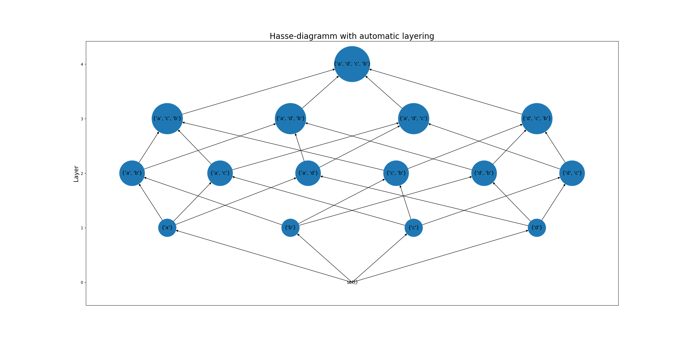

# A hasse-diagramm layout for networkx

Hasse-diagramms are a usefull tool for the visualization of partially ordered sets. 

The file hasseNetworkx.py provides functions for their visualization using pythons networkx library. 

As input we have partially ordered set (M,R) represented by a networkx.DiGraph object where M is represented by the nodes and R by the edges. 
**hasseNetworkx.transitivity_elimination(Graph)** 
removes edges from the graph where the relationship of elements is implied by other paths in the graph and the transitivity of R 
**layout(Graph, layer_function=None, shift_x=False)** 
returns a dictionary of the positions for the nodes and can be used in the same way as any other networkx layout function. 
The optional parameter layer_function can be a user defined function that assigns layers to nodes based on some properties of the nodes. 
The optional parameter shift_x can be used to prevent most of the possible overlaps of edges in the graph. 

  

